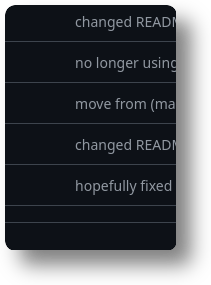
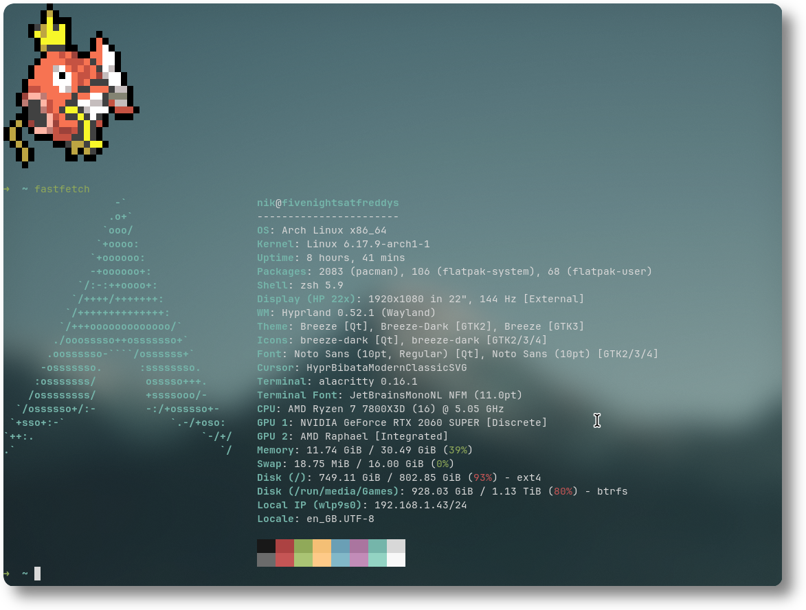

# fancygrim

a small bash script that I use for screenshotting. (hyprland only)  
i made this because I was infuriated with the lack of good screenshotting tools. This tool takes a screenshot and THEN resizes it, instead of taking a resizing and taking a screenshot of slurp. It also allows you to toggle a shadow and change the border radius for each individual mode. It makes it a *little* slower, but tbh i don't care all too much.

> [!IMPORTANT]
> This was made for Hyprland/Wayland in mind.  
> This will not work on X11, due to the use of `slurp`.
  
## examples

area screenshot: (`fancygrim area -c 10 -s`)  
  
window screenshot: (`fancygrim window -c 15 -s`)  
  
  
## features

- area, window & full screenshots
- shadows & corner rounding
      - shadows can be toggled
      - border radius can be configured.
- a small range of options
      - explained in `fancygrim usage`
- notification w/ preview

## default settings (with no options)

```bash
Shadow=false # whether or not to have a shadow by default, you can enable this with the "--shadow" flag
CornerIntensity=10 # how intense the corners should be

Notification=true # whether or not to send a notification after the screenshot has been taken
PreNotification=true # whether or not to send a notification after the screenshot has begun processing
NotificationImage=true # whether or not the notification that is sent after the screenshot is taken should include that screenshot.

CopyToClipboard=true # whether or not to copy the Image do your clipboard
PasteOnce=false # whether or not the screenshot can be pasted only once
WriteImage=false # whether or not to write the image to disk
WriteDirectory="/home/$USER/Pictures/" # where the image should be written to disk
```

## dependencies

- grim
- slurp
- imagemagik
- jq
- hyprpicker
- hyprctl
- wl-clipboard
- bash
- sudo (for the installer)
- wget (for the installer)
  
Arch Example:

```bash
sudo pacman -S grim slurp imagemagik jq wl-clipboard && yay -S hyprpicker
```

(hyprpicker is in the AUR, bash is needed to run the command, hyprctl comes with hyprland ootb)

## installation

### release version (stable, recommended)

```bash
git clone https://github.com/deadfry42/fancygrim && bash ./fancygrim/installation.sh stable`
```
  
### git version (unstable, unrecommended)

> [!WARNING]  
> May be unstable, please use with caution.

```bash
git clone https://github.com/deadfry42/fancygrim && bash ./fancygrim/installation.sh git
```

(installation.sh found at the root of this repo, check if you don't trust this.)

# License
This project is licensed under [GLWTS](./LICENSE)  
Translations available at https://github.com/me-shaon/GLWTPL/tree/master/translations
